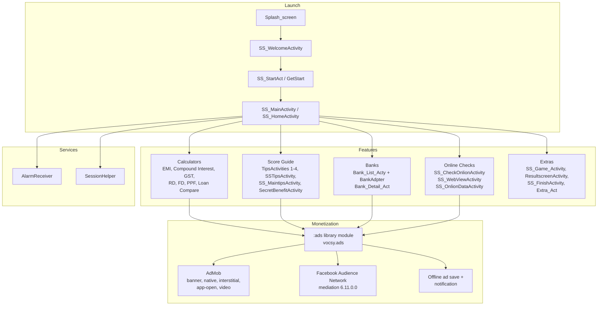

<p align="center">
  
</p>

<p align="center">
  
  
  
  
  
</p>

> **Developed by [Arslan Malik](https://github.com/arsalanmaalik461)**
> 📱 WhatsApp: [+92 300 8987448](https://wa.me/923008987448) · 🌐 Website: [arslanmalik.tech](https://arslanmalik.tech)

---

## 🌟 Executive Overview

**Credit Score** (package `com.free.validator.loan.homeloan.creditscrore`) is a native Android application, written in Java, that helps everyday users understand, check, and improve their credit score — with content focused on India's credit ecosystem (CIBIL, Experian, Equifax, CRIF High Mark, and RBI rules). The app explains the five factors that decide a score — credit history (35%), credit utilization (30%), credit age (15%), credit mix (10%), and credit inquiries (10%) — and walks users through score bands from 300 (poor) to 900 (excellent), hard vs. soft enquiries, fraud watch, and dispute resolution.

Beyond credit education, the app ships a full suite of built-in financial calculators: EMI, compound interest, GST, recurring deposit (RD), fixed deposit (FD), and PPF — plus a home-loan focus, a loan comparison tool, and a browsable bank directory with detail screens. Online credit-score checks are handled through guided WebView links to official bureau and aggregator portals (CIBIL, BankBazaar, India Ratings), while the calculators work fully offline. Monetization is baked in through a dedicated `:ads` library module serving AdMob (banner, native, interstitial, app-open, and video ads) with Facebook Audience Network mediation, including offline ad saving with a notification when the user is back online.

---

## 📑 Table of Contents

- [✨ Key Features & Highlights](#-key-features--highlights)
- [🖥️ Feature Showcase](#️-feature-showcase)
- [🏗️ System Architecture](#️-system-architecture)
- [🚀 Quickstart & Installation Guide](#-quickstart--installation-guide)
- [📂 Project Structure](#-project-structure)
- [🛡️ Security & Notes](#️-security--notes)

---

## ✨ Key Features & Highlights

| Feature | Description |
| :--- | :--- |
| 📊 Credit Score Guide | Step-by-step education on what a credit score is, how it is computed, and how to get a free score (300–900 scale) |
| ⭐ Score Bands & Factors | Visual breakdown of bands (poor / average / good / excellent) and the five scoring factors with their weights |
| 🧮 EMI Calculator | Principal + interest rate + tenure → monthly EMI, total interest, and total payable amount |
| 💰 Savings Calculators | Compound interest, FD, RD, and PPF calculators for savings planning |
| 🧾 GST Calculator | Quick GST computation for everyday purchases and bills |
| ⚖️ Loan Comparison | Compare loan options side by side (interest, tenure, cost) |
| 🏦 Bank Directory | Browsable bank list with detail screens (`Bank_List_Acty`, `Bank_Detail_Act`) |
| 🌐 Online Score Check | WebView-based guided links to CIBIL, BankBazaar, Cashkumar, and India Ratings portals |
| 📴 Offline Mode | Calculators work fully offline; ads can be saved offline and opened via notification later |
| 💡 Tips & Secrets | Curated tips screens: benefits of a good score, score secrets, enquiry types, fraud watch |
| 🎮 Engagement | Welcome/onboarding flow, tips carousel, and a game activity for user engagement |
| 💵 Ad Monetization | Dedicated `:ads` library module: AdMob banner/native/interstitial/app-open/video + Facebook Audience Network mediation |

---

## 🖥️ Feature Showcase

### 1. Credit Score Education Hub

> "Know your credit, grow your future."

- Explains the credit score range **300–900** and what each band means for loan and credit-card approval
- Documents the five scoring factors with exact weights: history 35%, utilization 30%, age 15%, mix 10%, inquiries 10%
- Covers the four Indian credit bureaus (CIBIL TransUnion, Experian, Equifax, CRIF High Mark) and RBI's reporting mandate
- Clarifies **hard vs. soft enquiries** and why checking your own score never hurts it
- Directs users to official dispute-resolution channels for report errors

### 2. Financial Calculator Suite

> "Every number that matters, calculated on your phone."

- **EMI Calculator** (`SS_EmiCalculatorActivity`): enter principal, annual rate, and months to get monthly EMI, total interest, and total payable — powered by seek-bar and spinner inputs (IndicatorSeekBar, PowerSpinner)
- **Compound Interest** (`SS_CompoundInterestActivity`), **FD** (`S_FdActivity`), **RD** (`RdActivity`), **PPF** (`PPFActivity`) for savings and investment planning
- **GST calculator** (`SS_GstActivity`) and **home-loan focus** matching the app's loan package identity
- Scalable, device-independent layouts via `sdp-android` and Glide-loaded imagery

### 3. Banks & Online Checks

> "Find the right bank, check the right score."

- Bank directory with a recycler-style list and detail screens for bank information
- In-app WebView flow with one-tap copyable links to official score-check portals (CIBIL, BankBazaar free Experian score, India Ratings company reports)
- Offline calculator screens (`SS_CheckOfflineActivity1/2/3`, `Check_Offline_Act`) for use without internet
- Background service helpers (`AlarmReceiver`, `SessionHelper`) for session and notification logic

---

## 🏗️ System Architecture



**Honest stack summary:** native Android app in **Java 8** (AGP 8.0.1, `compileSdk 33`, `minSdk 24`, `targetSdk 33`), UI built on **AndroidX AppCompat + Material Components + ConstraintLayout**, enhanced with **PowerSpinner**, **IndicatorSeekBar**, **sdp-android**, and **Glide**. Ads are isolated in a separate `:ads` library module (`vocsy.ads`) so the main app only depends on a clean `GoogleAds` facade.

---

## 🚀 Quickstart & Installation Guide

### Prerequisites

- **Android Studio** (Hedgehog 2023.1.1 or newer — required for Android Gradle Plugin 8.0.1)
- **JDK 17** (AGP 8.x requires JDK 17 to run Gradle)
- **Android SDK 33** (compile/target) — Android SDK Build-Tools and Platform installed via SDK Manager
- A device or emulator running **Android 7.0 (API 24)+**

### Build & Run

```bash
# 1. Clone the repository
git clone https://github.com/arsalanmaalik461/Creadit-Score.git
cd Creadit-Score

# 2. Open the project in Android Studio and let Gradle sync
#    (uses google(), mavenCentral(), gradlePluginPortal())

# 3. Run on a connected device / emulator from Android Studio,
#    or via the command line:
./gradlew installDebug
```

### Release Build

```bash
./gradlew assembleRelease
# APK output: app/build/outputs/apk/release/app-release.apk
```

`minifyEnabled` is currently `false`; ProGuard rules live in `app/proguard-rules.pro` and `ads/proguard-rules.pro` for when shrinking is enabled.

### Before Publishing

1. Replace the **test AdMob IDs** in `app/src/main/res/values/strings.xml` (`ADMOB_APP_ID`, `bnr_admob`, `native_admob`, `int_admob`, `app_open_admob`, `video_admob`, `admob_app_id`) with your real AdMob app/unit IDs.
2. Replace the placeholder privacy policy URL (`https://example.com/`) with your real privacy policy page.
3. Sign the release build with your own keystore and bump `versionCode`/`versionName` in `app/build.gradle`.

---

## 📂 Project Structure

```
Creadit-Score/
├── README.md
├── docs/
│   └── assets/
│       └── banner.svg
├── build.gradle                  # AGP 8.0.1 plugin declarations
├── settings.gradle               # Modules: :app, :ads
├── gradle.properties             # AndroidX, JVM args
├── gradlew / gradlew.bat
├── gradle/
├── app/
│   ├── build.gradle              # applicationId com.free.validator.loan.homeloan.creditscrore
│   │                             # compileSdk 33, minSdk 24, targetSdk 33, v1.0
│   ├── proguard-rules.pro
│   └── src/
│       ├── main/
│       │   ├── AndroidManifest.xml
│       │   ├── java/com/free/validator/loan/homeloan/creditscrore/
│       │   │   ├── SS_MainActivity.java / SS_HomeActivity.java   # home
│       │   │   ├── SS_EmiCalculatorActivity.java                 # EMI calculator
│       │   │   ├── SS_CompoundInterestActivity.java              # compound interest
│       │   │   ├── SS_GstActivity.java                           # GST calculator
│       │   │   ├── RdActivity.java / S_FdActivity.java           # RD / FD
│       │   │   ├── PPFActivity.java                              # PPF calculator
│       │   │   ├── SS_CompareLoanActivity.java                   # loan comparison
│       │   │   ├── Bank_List_Acty.java / Bank_Detail_Act.java    # bank directory
│       │   │   ├── SS_TipsActivity1/2, ss_TipsActivity4.java      # score education
│       │   │   ├── SSTipsActivity.java / SS_MaintipsActivity.java
│       │   │   ├── SecretBenefitActivity.java
│       │   │   ├── SS_CheckOnlionActivity.java                   # online checks
│       │   │   ├── SS_WebViewActivity.java / SS_OnlionDataActivity.java
│       │   │   ├── Check_Offline_Act.java / SS_CheckOfflineActivity1/2/3.java
│       │   │   ├── SS_Game_Activity.java                         # engagement
│       │   │   ├── Splash_screen.java / SS_WelcomeActivity.java  # onboarding
│       │   │   ├── ResultscreenActivity.java / SS_FinishActivity.java
│       │   │   ├── Calculator_Act.java / SumTotalb.java / Extra_Act.java
│       │   │   └── Service/ (AlarmReceiver.java, SessionHelper.java)
│       │   └── res/                # 77 layouts, anim, drawable*, font, menu,
│       │                           # raw, values (strings, themes), xml
│       ├── androidTest/            # Espresso instrumentation tests
│       └── test/                   # JUnit unit tests
└── ads/                            # vocsy.ads ad library module
    ├── build.gradle                # AdMob play-services-ads 20.6.0,
    │                               # Facebook mediation 6.11.0.0
    ├── proguard-rules.pro
    └── src/
```

---

## 🛡️ Security & Notes

- **Test ad IDs:** the repo ships with Google's official *sample* AdMob IDs (`ca-app-pub-3940256099942544/...`) and a placeholder privacy URL (`https://example.com/`). These are not real publisher IDs — replace them before any production release.
- **Cleartext traffic:** the manifest sets `android:usesCleartextTraffic="true"`. Prefer HTTPS-only for any production build handling real user data.
- **Permissions:** the app requests network, storage, notifications, exact alarms, boot-completed, and badge permissions — driven by the ads library and notification flows; review and trim anything you don't ship.
- **External links:** online score checks deep-link to official bureau/aggregator sites (CIBIL, BankBazaar, India Ratings) — the app itself does not pull live credit reports; it educates and links out.
- **No analytics/PII collection** is visible in the app module's own code; the Firebase database URL placeholder in `strings.xml` is redacted/unset in this repo.

---

<p align="center">
  Developed with ❤️ by <a href="https://github.com/arsalanmaalik461"><b>Arslan Malik</b></a><br>
  📱 WhatsApp: <a href="https://wa.me/923008987448">+92 300 8987448</a> · 🌐 Website: <a href="https://arslanmalik.tech">arslanmalik.tech</a>
</p>
